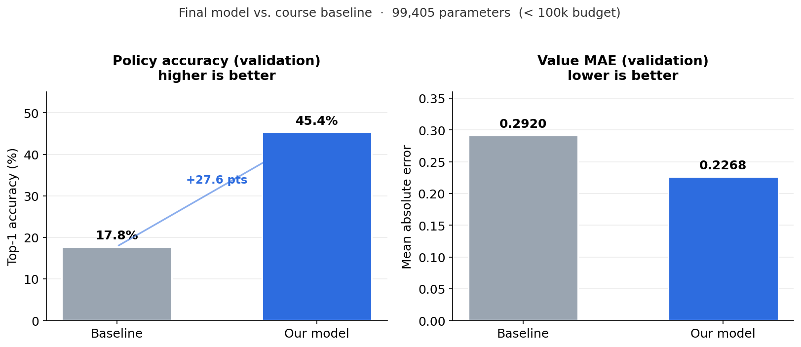

# Go Move Prediction — A Residual Network Under 100k Parameters

[](https://www.python.org/)
[](https://www.tensorflow.org/)
[](https://keras.io/)
[](#parameter-budget)

> **Academic project** — Deep Learning course, Université Paris Dauphine – PSL (2025–2026).
> Authors: Tomil Shi, Émile Descroix, Alexis Michel.

This is our course project on the game of Go. We trained a small neural network that, given a board position, predicts both **where to play next** (the *policy*) and **who is likely to win** (the *value*) — the same two outputs that drive AlphaGo-style engines. The twist, and the part that made the project interesting, is a hard constraint: the model must stay **under 100,000 parameters**. Most of our design choices come from squeezing as much as possible out of that tiny budget.

A full write-up (in French) is available in [`Rapport_DeepLearning.pdf`](Rapport_DeepLearning.pdf).

## The problem

Go is played on a 19×19 board, which gives roughly 2.1×10¹⁷⁰ legal positions — more than the number of atoms in the observable universe. Brute-force search is hopeless, so the modern approach (since DeepMind's AlphaGo in 2016) is to let a neural network learn good intuitions directly from games. Our network has two heads:

- **Policy** — a probability distribution over the 361 board points, i.e. how likely each point is to be the next move.
- **Value** — a single number in `[0, 1]`, the estimated win probability for White in the current position.

The training data comes from **1,000,000 self-play games generated by [KataGo](https://github.com/lightvector/KataGo)**, one of the strongest open-source Go engines.

## Data

Each position is encoded as a `19 × 19 × 31` tensor — 31 binary planes describing the board:

| Plane(s) | Description |
|----------|-------------|
| 0        | Colour to play (1 = Black, 0 = White) |
| 1–2      | Current board state (black / white stones) |
| 3–6      | Two previous board states (2 × 2 colours) |
| 7–30     | Ladders and other tactical features |

Loading is handled by **`golois`**, a compiled C module provided with the course. It exposes `getBatch` (load `N` positions from `games.data`) and `getValidation` (load a fixed validation set so results stay comparable across runs). `golois` is **not** on PyPI — see [Running it](#running-it).

## Model architecture

We follow the classic AlphaZero layout: a shared residual trunk feeding two specialised heads. Because of the parameter budget, the trunk is built from **depthwise-separable convolutions** instead of standard ones, which cost roughly 9× fewer parameters for 3×3 filters.

```
board (19×19×31)
        │
   Conv2D(64, 3×3) + BN + ReLU          ← entry block (standard conv)
        │
   7 × [ separable residual block ]     ← shared trunk
        │
   ┌────┴─────────────────┐
 policy head           value head
 (→ 361 softmax)        (→ win prob.)
```

A few decisions worth pointing out:

- **The entry block uses a standard `Conv2D`, not a separable one.** Separable convolutions only pay off when input channels are independent, but our 31 planes are heavily correlated (current state, history, ladders), so a standard convolution mixes them better at the start.
- **Each residual block ends with a Squeeze-and-Excitation (SE) block** (ratio 8), which lets the network re-weight feature channels based on the global content of the position — cheap (~1,100 params per block) but effective.
- **The value head uses Global Average Pooling instead of Flatten**, replacing 32×19×19 = 11,552 values with 32 averages and saving several thousand parameters in the dense layer that follows.

### Parameter budget

| Component | Parameters | Share |
|-----------|-----------:|------:|
| Entry block — Conv2D(64, 3×3) | 18,112 | ≈ 18% |
| 7 separable residual blocks (incl. SE) | 76,664 | ≈ 77% |
| Policy head | 276 | ≈ 0.2% |
| Value head | 4,353 | ≈ 4% |
| **Total** | **99,405** | **100%** |

That's **99,405 parameters** — comfortably under the 100k limit (97,413 of them trainable, the rest being BatchNorm statistics).

## Training

- **Data augmentation (D₄ symmetry group).** Go is invariant under 90° rotations and horizontal flips, so each epoch we apply one of the 8 equivalent transformations to the board and policy target simultaneously. This multiplies the effective diversity of positions by 8, for free.
- **Composite loss.** Categorical cross-entropy for the policy, binary cross-entropy for the value, combined as `2.0 · L_policy + 1.0 · L_value` — policy accuracy is the metric we're graded on, so it's weighted higher.
- **Optimizer.** Adam with a **cosine decay** schedule from `1e-3` down to `1e-6`. We avoided plateau-based schedulers because the data distribution shifts at every `getBatch` call, which would trigger premature, unjustified learning-rate drops.
- **Protocol.** 3,000 epochs of 10,000 positions each → **30 million positions seen** (≈ 30× the dataset). A full validation pass and a checkpoint are saved every 50 epochs.

| Hyperparameter | Value |
|----------------|-------|
| Epoch size (N) | 10,000 |
| Batch size | 256 |
| Epochs | 3,000 |
| Initial / min learning rate | 1e-3 / 1e-6 |
| Schedule | Cosine decay |
| Optimizer | Adam (β₁=0.9, β₂=0.999) |
| Policy / value loss weights | 2.0 / 1.0 |
| L2 regularization | 1e-4 (all layers) |
| Augmentation | D₄ (8 transformations) |

## Results



| Metric | Baseline | Our model |
|--------|---------:|----------:|
| Parameters | 65,479 | 99,405 |
| Policy accuracy (validation) | 17.8% | **45.40%** |
| Value MAE (validation) | 0.292 | **0.2268** |

On the held-out validation set the model picks the same move as the reference games **45.4%** of the time, up from the **17.8%** baseline. Validation accuracy (45.40%) even edges out training accuracy (44.90%), which suggests the model generalises well and isn't overfitting — we credit the D₄ augmentation for that.

## Repository structure

```
.
├── train.py                                   # model definition + training loop
├── Emile_DESCROIX-Alexis_MICHEL-Tomil_SHI.h5  # final trained model (Keras 3)
├── Rapport_DeepLearning.pdf                   # full report (French)
├── assets/
│   └── results.png                            # results figure
├── requirements.txt
└── .gitignore
```

## Running it

```bash
# 1. Install the Python dependencies
pip install -r requirements.txt
```

> **Heads-up:** training requires `golois` and the `games.data` file, both provided with the course. `golois` is a compiled C module and is **not** installable via pip, so `train.py` will not run without it.

```bash
# 2. Train (long — 3,000 epochs)
python train.py
```

To load the trained model and run inference (this part only needs TensorFlow):

```python
import tensorflow.keras as keras

model = keras.models.load_model("Emile_DESCROIX-Alexis_MICHEL-Tomil_SHI.h5")
policy, value = model.predict(board)   # board shape: (batch, 19, 19, 31)
```

## Authors

Tomil Shi · Émile Descroix · Alexis Michel
Deep Learning course — Université Paris Dauphine – PSL (2025–2026)

## Acknowledgements

Thanks to the course staff for the `golois` framework and the KataGo self-play dataset. Architecture inspired by AlphaGo / AlphaZero (DeepMind), with Squeeze-and-Excitation blocks from Hu et al. (2018).

---

*Shared for educational and portfolio purposes.*
